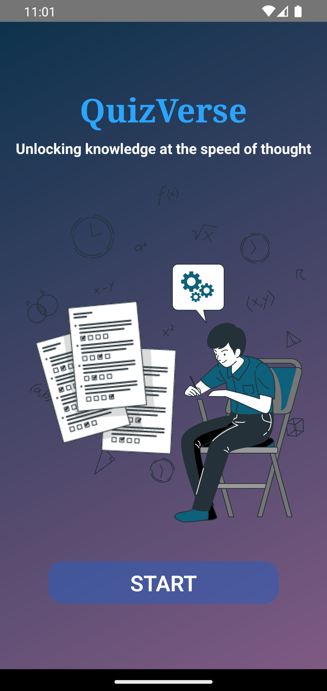
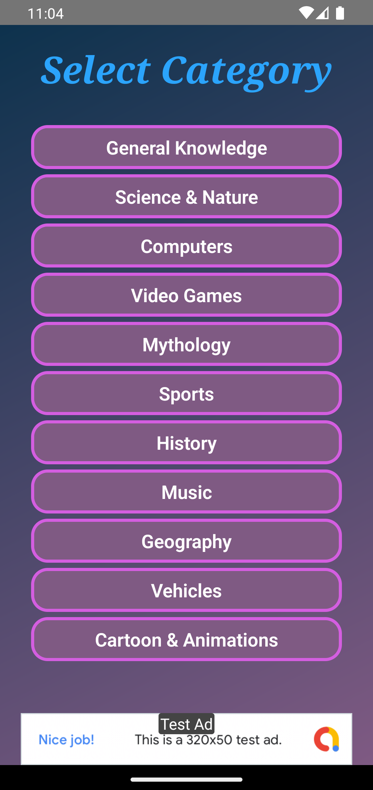
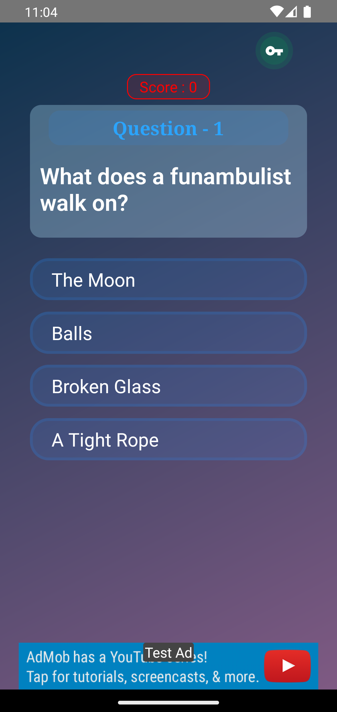
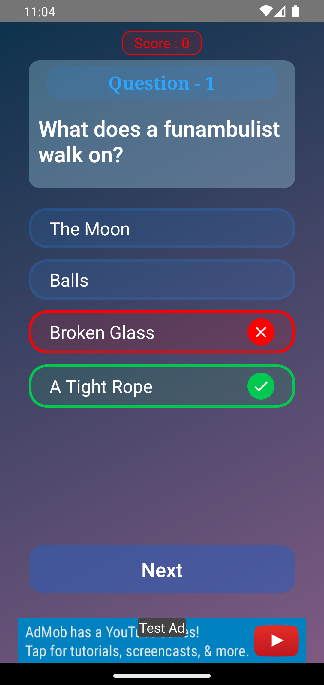
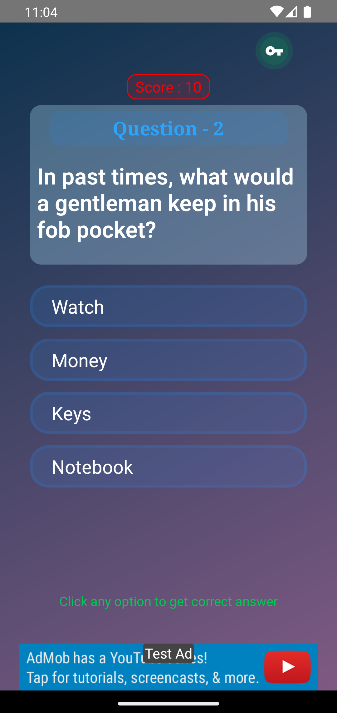

# Quiz_Verse

It is a quiz platform where you can find fun quizzes on variety of subjects like:

1) General Knowledge
 2) Science & Nature
 3) Computers
 4) Video Games
 5) Mythology
 6) Sports
 7) History
 8) Music
 9) Geography
10) Vehicles
11) Cartoon & Animations

👉 Evaluation Scheme
Every correct answer will give you 10 points.

 👉 Winning Condition
If you get a score of greater than 40 on the quiz, you will be the winner.

👉 Reward Feature
A key button is located in the top right corner of the question screen. If you hit that button, you will receive the right answer to that question as well as points for that specific question.

## 
## 
## 
## 
## 
## 
